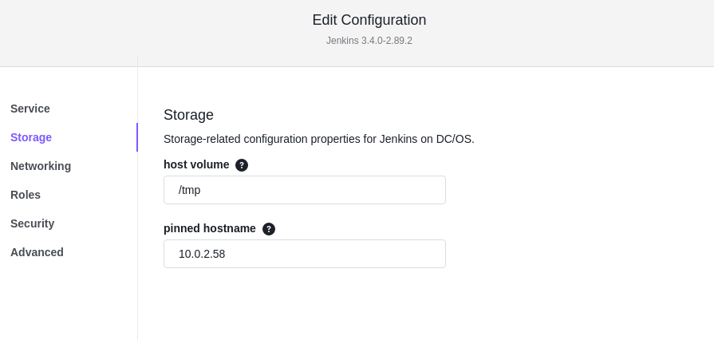
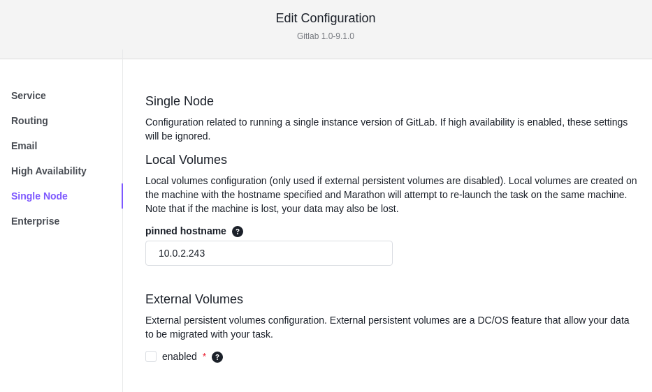
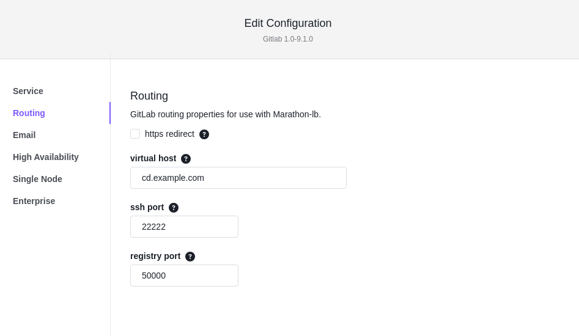
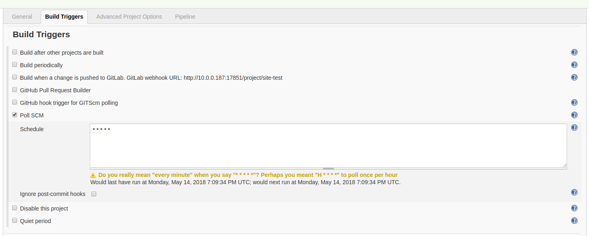
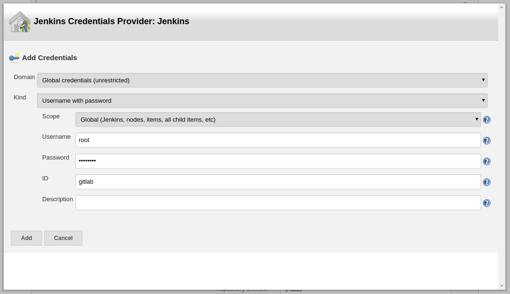
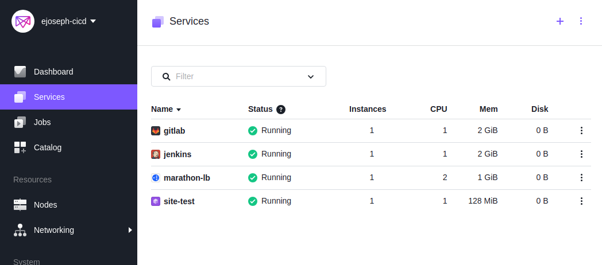

# Continuous Delivery with GitLab and Jenkins

This demo presents a continuous integration and deployment (CI/CD) workflow using GitLab and Jenkins on DC/OS. In this demo we’ll be creating a simple website, testing it to make sure all the links work, and then deploying it in production if it passes.

- Estimated time for completion: 30min
- Target audience: Anyone interested in simplifying the deployment of a CI/CD pipeline.

**Table of Contents**:

- [Architecture](#architecture)
- [Prerequisites](#prerequisites)
- [Install](#install)
- [Use the demo](#use)

## Architecture

## Prerequisites

- A running [DC/OS 1.10](https://dcos.io/releases/) or higher cluster with at least 3 private agents and 1 public agent. Each agent should have 2 CPUs and 5 GB of RAM available. The [DC/OS CLI](https://dcos.io/docs/1.11/usage/cli/install/) also needs to be installed.
- The [dcos/demo](https://github.com/dcos/demos/) Git repo must be available locally, use: `git clone https://github.com/dcos/demos/` if you haven't done so yet.
- [SSH](https://dcos.io/docs/1.11/administration/access-node/sshcluster/) cluster access must be set up.
- Ports 22222 and 50000 opened on the public agent where Marathon-lb is running.
- The ability to add a DNS A record to use for GitLab that you and the cluster have access to, if you don't have a domain or run DNS, you may use a free service like <a href="https://www.noip.com/">noip.com</a>.

The DC/OS services used in the demo are as follows:

- GitLab
- Jenkins
- Marathon-lb

## Setup

Get the <a href="https://docs.mesosphere.com/1.11/administering-clusters/locate-public-agent/">address of your public agent</a> and set up a DNS A record to use for GitLab. In this demo we'll be using cd.example.com, you'll want to replace this in all examples.

If you have SSL certificates configured which will be used by the Public Agent, you're all set. Otherwise, you'll want to log into your private nodes and configure Docker to <a href="https://docs.docker.com/registry/insecure/">use an insecure registry</a>. Using an insecure registry is not appropriate for production, but for the purpose of a private demo it may be used:

```
sudo mkdir -p /etc/systemd/system/docker.service.d/
sudo vim /etc/systemd/system/docker.service.d/insecure-registry.conf
```

The contents of insecure-registry.conf should be the following:

```
[Service]
Environment='DOCKER_OPTS=--insecure-registry=cd.example.com:50000'
```

Remember to replace `cd.example.com` with the A record you have pointed at your public agent.

Now reload Docker and confirm the parameter has been passed:

```
sudo systemctl daemon-reload
sudo systemctl restart docker
systemctl show --property=Environment docker
```

Warning: By default, restarting Docker will cause your running containers to restart.

Later, we will also need to configure Jenkins to pull from an insecure registry during the deployment step.

## Install

Now you'll want to install Marathon-LB. We're not making any changes, so it's easy to simply do this from the DC/OS CLI if you wish:

```
dcos package install marathon-lb
```

Next, install Jenkins. In production you'll want to make sure Jenkins is running on one of the nodes where shared, persistent storage is located. For this demo it's fine to simply pin it to a private node of your choosing and save the files in /tmp on that node. Pinning to a node can easily be done by installing Jenkins through the web UI and filling out the Storage tab and setting a "Pinned Hostname" that points to one of your private nodes.



Once Jenkins is installed, if you don't have SSL certificates set up you'll need to configure Jenkins to accept an insecure registry so it can launch Docker images from it. This can be completed by follwoing instructions in the <a href="https://docs.mesosphere.com/services/jenkins/advanced-configuration/">Jenkins Advanced Configuration</a> section of the DC/OS service documentation.

Now it's time to install GitLab. Just like Jenkins, we'll want to pin this to a hostname for this demo just in case the container restarts. In a production environment you'll want to mount external storage shared storage so that GitLab can move between nodes, but for a quick demo you may use the limited in-container non-persistent storage. In order to pin it to a node, go into the "Single Node" section of the configuration and put in the IP address of the private node you wish to run it on in the section for "pinned hostname".



You'll also want to set the "virtual host" in the routing section to match the name you created in DNS.



Once GitLab is installed, immediately navigate to the address you set up (we're using http://cd.example.com as an example) and set a password for GitLab. Once a password is set, you can log in with the "root" user and this password.

This concludes the tooling you need installed, you can now get started setting up your repository and deployment pipeline!

## Set Up Repository and Job

Once you've logged into GitLab, you want click on "New Project" to create a repository. You'll want to give it a Project name of "site-test" and make it Public.

Tip: In production, the root user wouldn't typically own repositories like this, they would be owned by less privileged users.

You can now clone this empty repository to your local system:

```
git clone http://cd.example.com/root/site-test.git
Cloning into 'site-test'...
warning: You appear to have cloned an empty repository.
```

One of the prerequisites for this demo was cloning the dcos/demos repository from GitHub as well. In the `demos/cicd/1.11/site-test/` directory you will find all the files that should now go into your newly created site-test repository, going through them one by one:

* index.html - Basic site file that we will deploy
* Dockerfile - Very basic Dockerfile which installs the index.html
* Jenkinsfile - Basic Jenkinsfile that defines the pipeline in Jenkins for building and deploying the test site
* marathon.json - Marathon definition for deploying the resulting image

As you're copying these into your new site-test repository, update the Jenkinsfile and marathon.json so that our cd.example.com is replaced with the address you're using for GitLab.

Now we'll want to create a pipeline job in Jenkins. On the main page for Jenkins, select "New Item". The item name will be "ngnix" and it's a "Pipeline" after hitting "OK" on that screen, you'll get to the page for configuring the pipeline. Scroll down to "Build Triggers" and select "Poll SCM" which takes cron-style scheduling. For this demo, we want to run it every minute, so in the text box put: * * * * *



In the Pipeline section of the same screen the definition should be "Pipeline script from SCM" and then select "Git". This will give you a place to put a Git repository, which in our example is http://cd.example.com/root/site-test.git and we will want to add credentials, since these will also be used for sending the image to the GitLab Docker registry, add the credential now and give it an ID of "gitlab".



Once this is saved, you have a pipeline.

Now return to your local site-test directory. We'll want to commit all the files you've added and push them to GitLab:

```
git add -A
git commit -m "Initial commit"
git push
```

You may navigate to your http://cd.example.com/root/site-test to see the files now uploaded there.

Now return to Jenkins and nagivate to your ngnix pipeline, it will run within a minute.


If the pipeline fails for any reason, there are logs there in the UI you can use to debug where the problem is.

Once the deployment succeeds, you can go back to the DC/OS UI and you will now see an "ngnix" service running. Naviate to /service/ngnix to see the website running.



Congratulations, you now have a deployment!

### 

Should you have any questions or suggestions concerning the demo, please raise an [issue](https://jira.mesosphere.com/) in Jira or let us know via the [users@dcos.io](mailto:users@dcos.io) mailing list.

